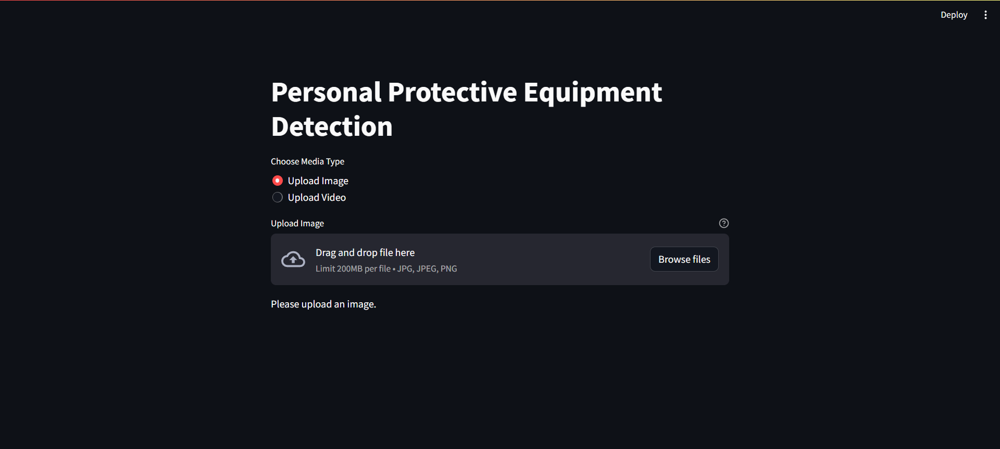
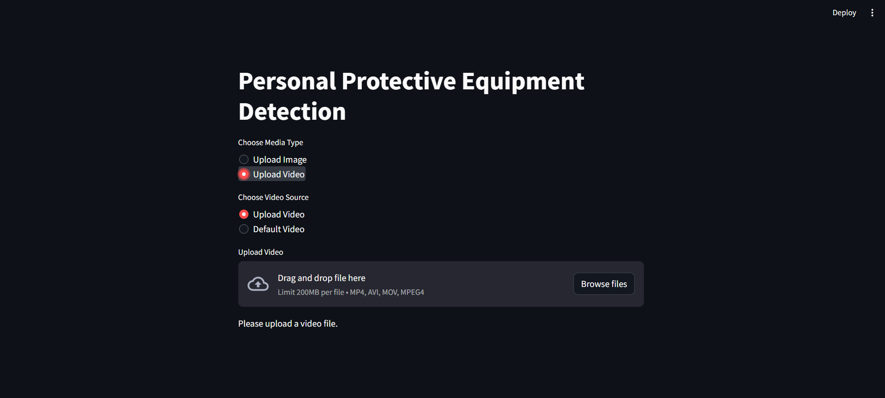
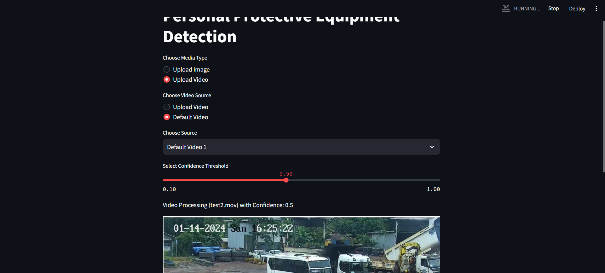
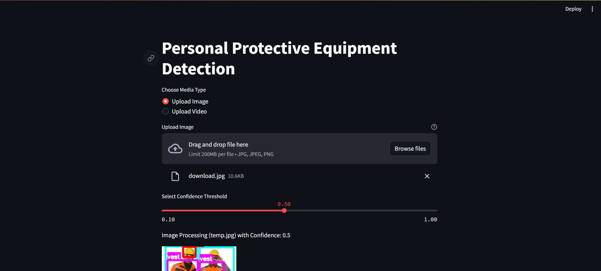

# Deteksi Alat Pelindung Diri (Personal Protective Equipment Detection)

## Langkah-langkah Install Aplikasi  
1. ### Clone Repository
   `git clone https://github.com/Handit14/Challenge_AI_Engineer.git`
2. ### Pindah Direktori
   `cd Challenge_AI_Engineer`
3. ### Install Virtual Environment
   `pip install virtualenv`
4. ### Buat Virtual Environment Baru
   `virtualenv env`
5. ### Aktifkan Virtual Environment (for Windows)
   `source env/Scripts/activate`
6. ### Install Dependencies
   `pip install -r requirements.txt`
6. ### Run Program
   `streamlit run app.py`

# Langkah-langkah Menjalankan Aplikasi   

Saat aplikasi dijalankan untuk pertama kalinya, akan muncul halaman seperti yang terlihat pada gambar di atas. Pada halaman tersebut, pengguna dapat memilih opsi tipe file berupa Gambar/Video yang akan diunggah untuk diproses deteksinya. 

Ketika memilih untuk mengunggah file bertipe Video, akan muncul opsi tambahan untuk memilih apakah ingin mengunggah file dari sistem lokal atau menggunakan video default yang telah disediakan. 

Tampilan di atas menampilkan proses deteksi secara real-time pada video. Pengguna dapat memilih nilai threshold confidence yang diinginkan, dan aplikasi akan menampilkan umpan balik visual berupa hasil deteksi APD. Begitu juga dengan gambar yang diproses, hasil deteksinya akan ditampilkan dengan cara yang serupa.
